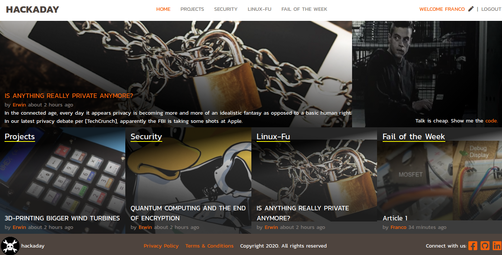

# LifeStyle-Hack

> This is an article demo page using Hackaday contents a sample.

[Hackaday](hackaday.com) is my daily reading so I enjoy to create a version of its web page using this [design](https://www.behance.net/gallery/14554909/liFEsTlye-Mobile-version).

I liked to build this project while reading hackaday posts, for this project I used Ruby on Rails as the backend and plain and HTML CSS on the frontend.

Postgres is the production database while all images are stored on [GoogleCould](https://cloud.google.com)

To make GCS work with rails I followed this [guide](https://medium.com/@pjbelo/setting-up-rails-5-2-active-storage-using-google-cloud-storage-and-heroku-23df91e830f8):

## Live Demo
I will feel honored if you try my app and tell me how to improve it.
it is hosted on a Heroku Free account so be patience, sometimes it takes a while to load.
[LifeStyle-Hack](lifestyle-hack.herokuapp.com)

## Presentation Video

  

## Wep app Features 

- Simple log-in function just using your username
- User can vote for its favorite article
- Most Voted article shown big on home page
- Links colored according to the natigation
- Articles shown according to the time they where created

## Built With

- Ruby
- HTML, CSS
- Postgres
- Deploy on [Heroku](heroku.com)
- Storaged on [Google](https://cloud.google.com)

## Author

👤 Franco Rosa

- Github: [@FrancoRosa](https://github.com/FrancoRosa)
- Linkedin: [Franco Rosa](https://www.linkedin.com/in/franco-rosa-79972119b)

## 🤝 Contributing

Contributions, issues and feature requests are welcome!
Feel free to check the [issues page](issues/).

## Show your support

Give a ⭐️ if you like this project!

## Acknowledgments

- [Zak ElMedjki](github.com/elmejdki) for his support and being my codding partner before doing this project.
- [Nelson Sakwa](https://www.behance.net/sakwadesignstudio) for the design that inspired this project
- [Hackaday](hackaday.com) some of the articles and images that I use in demo where picked from its webpage, please check their articles and support them.
- Team 94 Capricornus Microverse

## 📝 License

This project is [MIT](lic.url) licensed.
